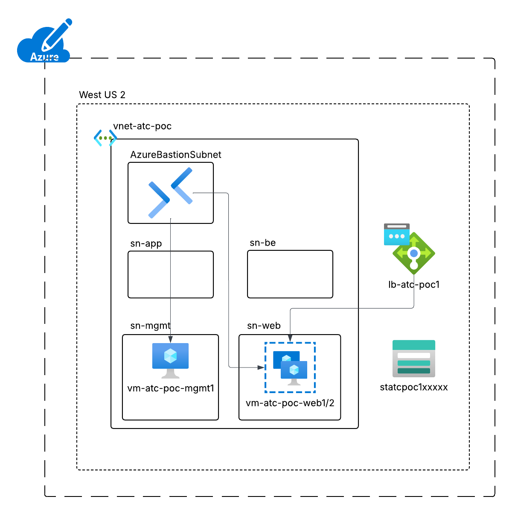

<<<<<<< HEAD
# Coalfire Azure Technical Challenge
**Submission for Russell George** 

## Summary
This submission is for the Coalfire Azure Technical Challenge as part of the Coalfire interviewing process. 
The resources deployed here are to satisfy a minimal proof of concept (POC) as detailed by the Coalfire team.

---
## Initial Notes and Assumptions
- No more than 8 hours time should be put towards the submission
- Other submissions found publicly available should not be used
- No restrictions on VM size or region provided
- POC tenant assumed to contain only a single subscription
    - this is important for the simplistic bootstrapping script that assumes a single tenant and subscription during authentication for service principle creation
- The load balancer is to be publicly accessible
    - this was later realized to have been a missed requirement for an internal load balancer
- Linux machines will authenticate with password for this POC to reduce complexity
- West US 2 region chosen for ease of deployment, availability of resources, and proximity to candidate deployment workstation
- Basic Azure Bastion is deployed to access virtual machines
    - this was later realized to have been a missed requirement for a public IP on the management VM
- At least 1 Coalfire module should be used
    - see challenges for why only a single Coalfire module (availability set) was used
- A deployment service principal is created with contributor access to the subscription
- Storage account is created first to bootstrap environment for Terraform state file
- Modules should be deployed with separate state files for resource blocks as best practice to reduce blast radius of changes
    - 1 resource stack for networking
    - 1 resource stack for management VM
    - 1 resource stack for web VMs and load balancer

---
## Environment Design


---
## Resources Deployed
* **1 Service Principal**
    * `sp-atc-deploy-01`
* **1 Storage Account**
    * `statcpoc1xxxxx`
* **4 Resource Groups**
    * `rg-atc-poc-mgmt`
    * `rg-atc-poc-network`
    * `rg-atc-poc-storage`
    * `rg-atc-poc-web`
* **1 Virtual Network**
    * `vnet-atc-poc`
* **5 Subnets**
    * `AzureBastionSubnet`
    * `sn-mgmt`
    * `sn-web`
    * `sn-app`
    * `sn-be`
* **1 Load Balancer**
    * `lb-atc-poc1`
* **3 Virtual Machines**
    * `vm-atc-poc-mgmt1`
    * `vm-atc-poc-web1`
    * `vm-atc-poc-web2`

## File structure
```
├───docs
├───env
│   └───poc
│       ├───mgmt
│       ├───network
│       └───web
├───modules
│   ├───compute
│   ├───load_balancer
│   ├───network
│   └───resource_group
├───scripts
└───validation
```

---
## Deployment Pre-requisites
- Terraform 1.5.7 must be installed and in the path
- Powershell 7.x installed for running .ps1 scripts or commands
    - alternatively az cli can be installed and these commands run from a Linux WS without using the scripts
    - if not using Powershell, the bootstrap script cannot be run and the deployment service principal and storage account must be created by other means

## Deployment Overview
- Environment is bootstrapped with a deployment service principal and storage account for the state file
- Network module is deployed first as it is a dependency for the other module deployments
- Management module is deployed next, but has no downstream dependencies
- Web module is deployed last, but could be deployed prior to the management module as there are no dependencies between them

### Deployment Process
The deployment process is summarized below and detailed in the *./scripts/deploy-poc.ps1* file
1. Bootstrap the environment using the *./scripts/bootstrap-terraform.ps1* script
    * `. .\scripts\bootstrap-terraform.ps1`
    * **NOTE:** if this script is not used, then the storage account *statcpoc1xxxxx* in resource group *rg-atc-poc-storage* must be created by other means and contain a container *terraformstate* for the terraform state file storage
2. Change to the proper *./env/poc/<resource_stack>* directory
    * `cd ./env/poc/network`
3. Run a Terraform Init and include the backend file
    * `terraform init -backend-config="./tfstate.tfbackend"`
4. Run a Terraform Plan
    * `terraform plan -out="atc-poc-network.plan"`
5. Run a Terraform Apply
    * `terraform apply "atc-poc-network.plan"`

* Alternatively, the *./scripts/deploy-poc.ps1* script can be run to create the entire deployment:
    * `. ./deploy-poc.ps1 -create`

### Deployment Clean-up Process
The deployment clean-up process is summarized below and detailed in the *./scripts/deploy-poc.ps1* file
1. Change to the proper *./env/poc/<resource_stack>* directory
    * `cd ./env/poc/web`
2. Run a Terraform Destroy
    * `terraform destroy`
3. Review the destroy resources and confirm
4. Repeat for the remaining resource stacks
5. Remove the storage account resource group
6. Remove the service principal

* Alternatively, the *./scripts/deploy-poc.ps1* script can be run to destroy the entire deployment:
    * `. ./deploy-poc.ps1 -destroy`

---
## Challenges
- The Coalfire public repository does not contain any Linux VM or load balancer modules
- The Coalfire storage account, virtual network and NSG modules are not a good fit for this POC due to configuration and/or complexity
- Deploying a complete POC with proper best practices and documentation in "a few hours" as detailed is difficult for a quality POC
    - this POC was put together in roughly 6 hours with an additional 2 hours of troubleshooting minor coding errors and missed requirements
- Missed the need to SSH from local machine to Management VM despite having added the NSG rule for admin SSH access per the requirements
    - manually added a public IP to *vm-atc-poc-mgmt1* VM in Azure Portal and captured screenshot from local workstation
- Missed the need for the load balancer to be internal only
    - due to time constraints, left external load balancer in place
    - would need to redeploy as an internal load balancer in order to satisfy the requirement
- Missed the need for the storage account to be locked down to the management VM
    - had access enabled to external IP for terraform deployments from local workstation
    - would need to adjust this and put terraform on the management workstation but skipped this due to time constraints

---
## Possible Improvements
- Move deployment model to management VM and avoid using local workstation
    - this was missed in the initial requirements and was skipped due to time constraints
- Use SSH key auth for the Linux VMs
    - password auth was selected due to time constraints
- Add a Key Vault and store the SSH key in it
    - pull the SSH key from the Key Vault during deployment
- Add boot diagnostics to the VMs
    - not necessary for this POC, but would be best practice in a production environment
- Add a Log Analytics workspace for additional logging and monitoring
    - not necessary for this POC, but would be best practice in a production environment
- Add an Application Gateway to front end the web VMs and add an SSL cert for HTTPS (in lieu of the basic Load Balancer)
    - not necessary for this POC, but would be best practice in a production environment
- Separate out the Management VM into a hub subscription and VNet
    - not necessary for this POC, but would be best practice in a production environment
- Separate out the script for the apache install into a file and call it from the module
    - this would allow for more simplistic editing of the scripted install
- Complete the bootstrapping script with error handling, passing of credentials, validation of roles, etc.
    - this script was a quick and dirty method due to time constraints
- Pull any hard coded valieus from the modules as variables (ie. resource names, and resource sub valieus)
    - this was done due to time constraints, and is less than ideal outside this quick POC
- Loop the module calls for scalability for more resources (not applicable for this small POC)
    - this was skipped due to time constraints and simplicity of this POC

---
## Sources Used
[Coalfire Availability Set Terraform Module](https://github.com/Coalfire-CF/terraform-azurerm-VM-AvailabilitySet/blob/main/README.md)

[Terraform AzureRM Docs](https://registry.terraform.io/providers/hashicorp/azurerm/latest/docs)

---
## Validations
**Bastion Access**

Bastion to mgmt VM


Bastion to web1 VM


Bastion to web2 VM


**Public LB Access**

Public LB to web1


Public LB to web2


**SSH Access**

SSH Access to mgmt VM


SSH Access to web1 VM


SSH Access to web2 VM

=======
# cf-atc-poc
>>>>>>> 159cd4e581242e5b5704b9204737339b5a3d8f8e
